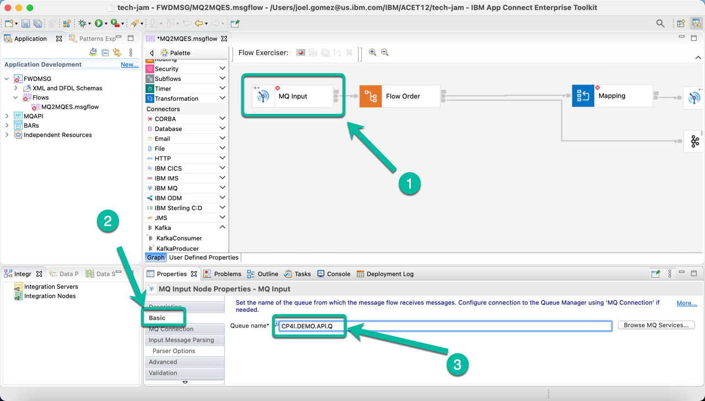

# Develop an Integration using ACE Toolkit to interact with MQ and Event Streams.

This article explains the steps needed to create an Integration Flow developed with *ACE Toolkit* that uses the *MQ Nodes* to interact with a **MQ Queue Manager** and the *Kafka Nodes* to interact with an **Event Streams cluster** using the latest version of the **ACE Integration Server Certified Container (ACEcc)** as part of the *IBM Cloud Pak for Integration (CP4I)*.

## Low Code / No Code Development with ACE Toolkit.

1. Open the Toolkit in your workstation and create a new REST API project as shown below.

2. Give a name to your project, i.e. *FWDMSG* and then click *Finish*.

3. In the project tree click *New* and select *Message Flow* from the pop up menu.

4. Give a new to your flow, i.e. *MQ2MQES* and then click *Finish*.

5. Double click the *Message Flow Editor* tab to maximize it and create your flow.

6. Drag and drop the *Nodes* from the palette to implemeng the "logic". In this case we will use the following nodes:
  * MQ Inout Node,
  * Flow Order Node,
  * Mapping Node,
  * MQ Output Node, and
  * Kafka Producer Node.

    And you will proceed to wire them. The flow should look like the one below. Once you are done double click the tab again in order to access the properties for each node. 

7. As part of the flow we will do some message transformation from JSON to CSV. In order to take advantage of the Mapping Node we need to define the corresponding *Message Model*. To do so, click on the *New* menu in the project tree and then select *Message Model* from the pop up menu.

8. Explore the different options. If you are using Mac you will notice *COBOL* is grayed out. For the same reason we will use CSV for this exercise, so select *CSV text* and click *Next*.

