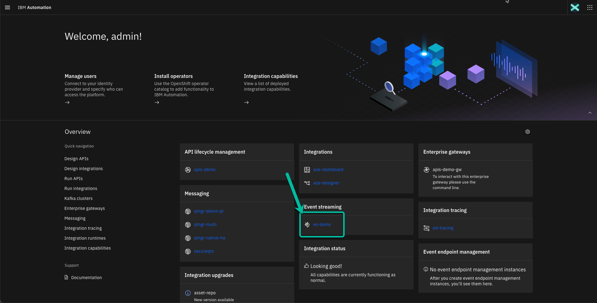
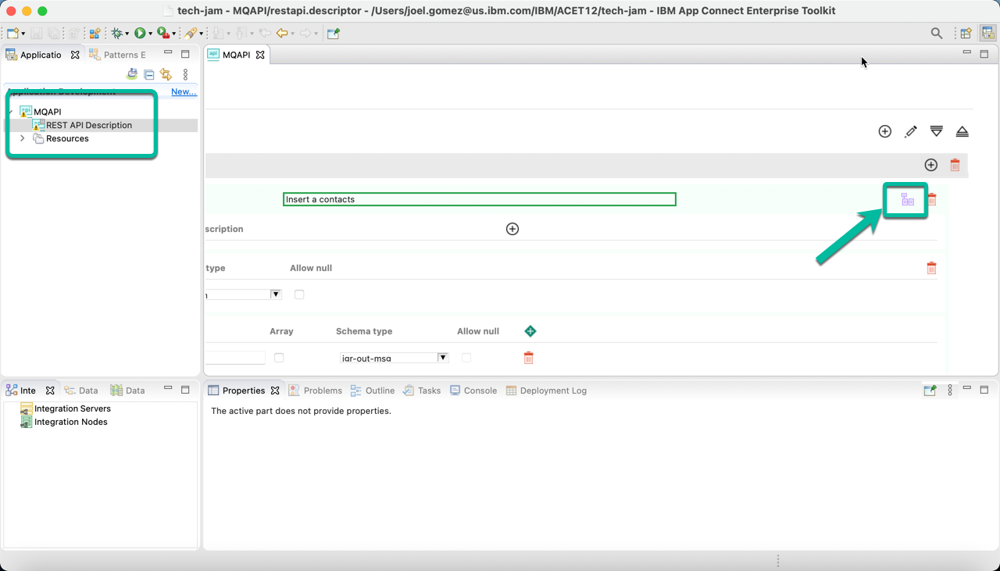
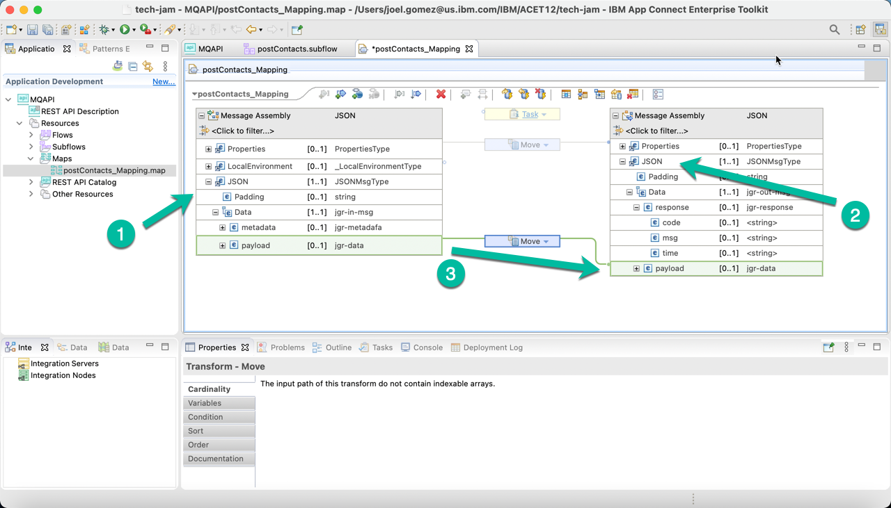
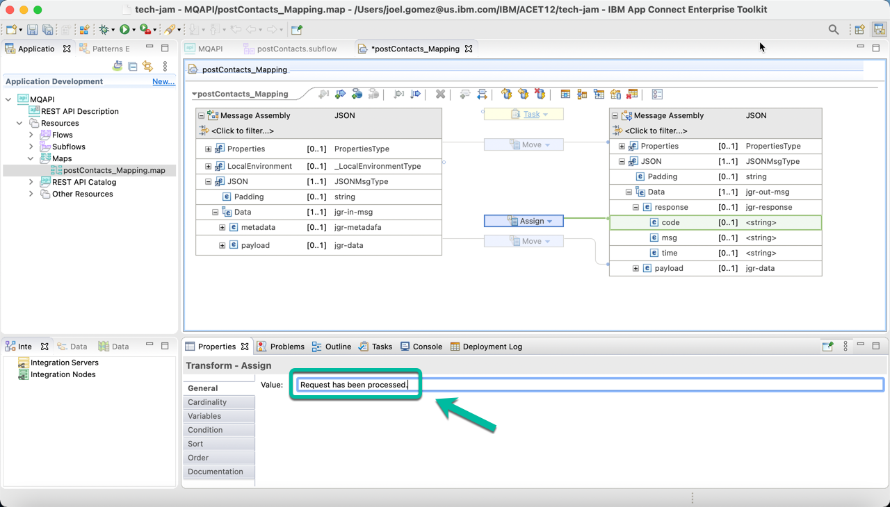
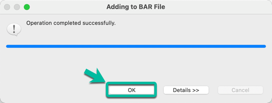

# Develop a REST API using ACE Toolkit to interact with MQ.

This article explains the steps need to create an Integration Flow developed with *ACE Toolkit* that uses the *REST API* functionality as well as the *MQ Nodes* to interact with an **MQ Queue Manager** using the latest version of the **ACE Integration Server Certified Container (ACEcc)** as part of the *IBM Cloud Pak for Integration (CP4I)*.

