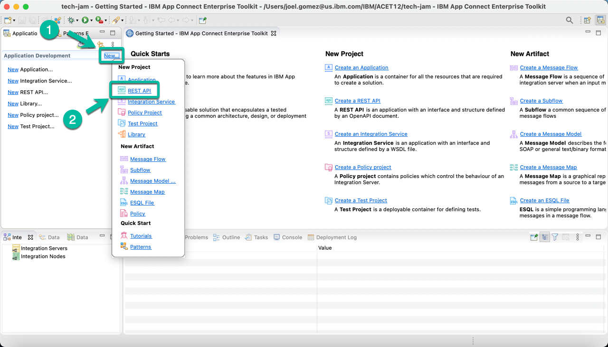
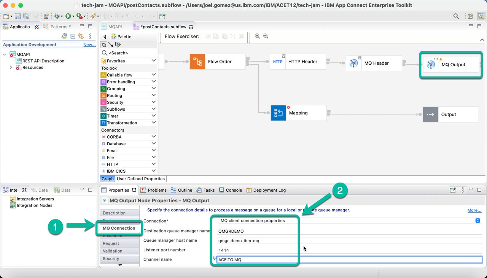
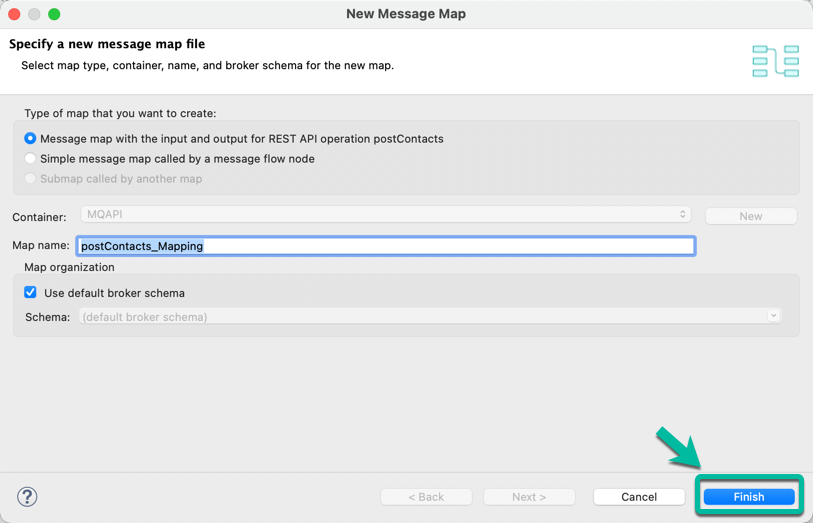
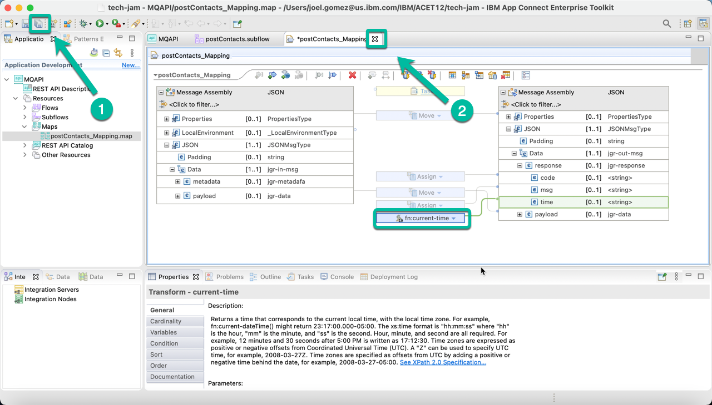
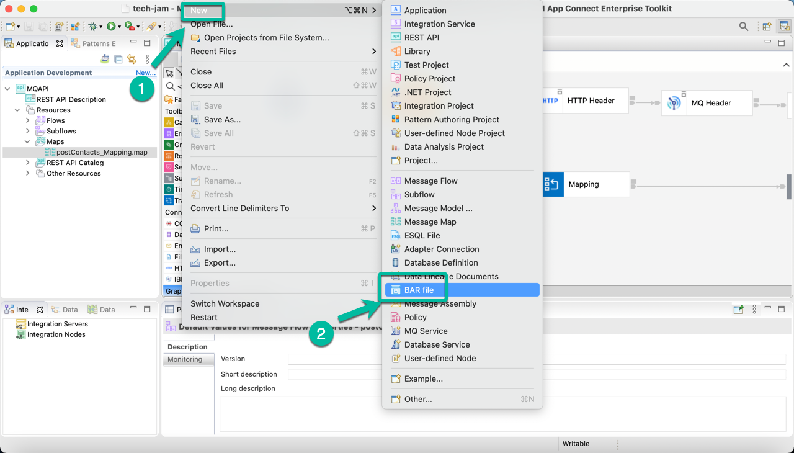

# Develop a REST API using ACE Toolkit to interact with MQ.

This article explains the steps need to create an Integration Flow developed with *ACE Toolkit* that uses the *REST API* functionality as well as the *MQ Nodes* to interact with an **MQ Queue Manager** using the latest version of the **ACE Integration Server Certified Container (ACEcc)** as part of the *IBM Cloud Pak for Integration (CP4I)*.

## Low Code / No Code Development with ACE Toolkit.

1. Open the Toolkit in your workstation and create a new REST API project as shown below.

2. Give a name to your project, i.e. *MQAPI* and then select the option to *Import resources* since we will leverage a definition already created.

3. In the wizard click *Browse* and navigate to the location where the OpenAPI file definition is located.

4. Once the path is displayed in the *Location* field click *Finish*.

5. The REST API will be displayed, scroll to the right if needed to open the sunflow operation as shown in the image to proceed to implement the API logic.

6. The *Message Flow Editor* will be open with only the *Input* and *Output* terminals. Double click the tab to maximize the editor and work with the flow.

7. Drag and drop the *Nodes* from the palette to implemeng the "logic". In this case we will use the following nodes:
  * Flow Order Node,
  * HTTP Header Node,
  * MQ Header Node,
  * MQ Output Node, and
  * Mapphin Node.

    And you will proceed to wire them. The flow should look like the one below. Once you are done double click the tab again in order to access the properties for each node.

8. Now we will configure each node, starting with the *HTTP Header Node*. Click on it to bring it to focus and then select the *HTTP Input* tab followed by the *Delete header* option as shown below.

9. Now select the *MQ Output Node*.

