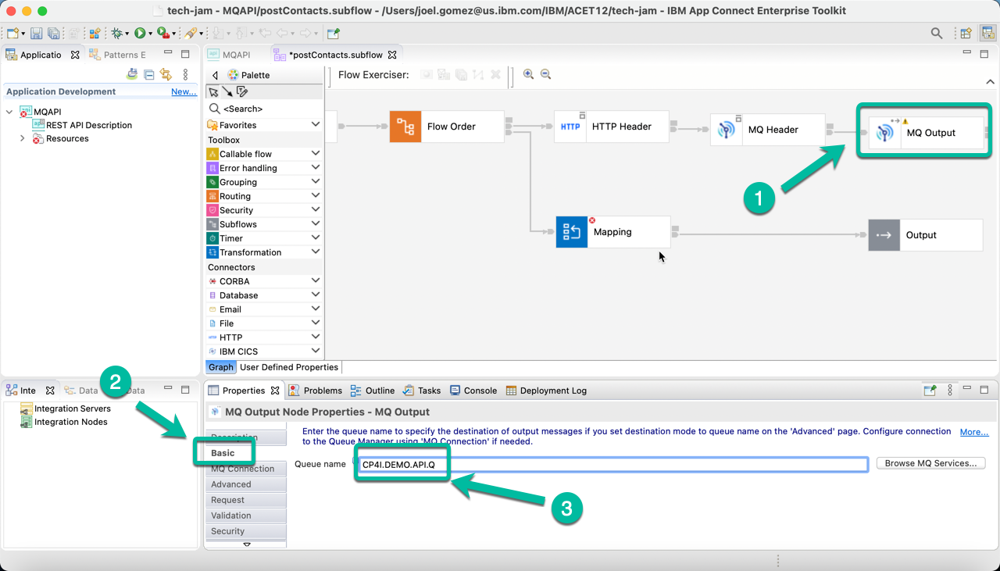
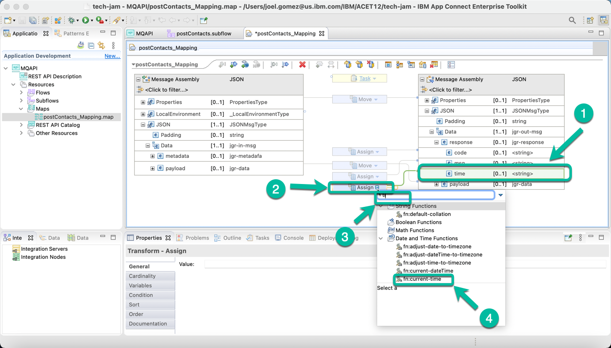

# Develop a REST API using ACE Toolkit to interact with MQ.

This article explains the steps need to create an Integration Flow developed with *ACE Toolkit* that uses the *REST API* functionality as well as the *MQ Nodes* to interact with an **MQ Queue Manager** using the latest version of the **ACE Integration Server Certified Container (ACEcc)** as part of the *IBM Cloud Pak for Integration (CP4I)*.

## Low Code / No Code Development with ACE Toolkit.

1. Open the Toolkit in your workstation and create a new REST API project as shown below.

2. Give a name to your project, i.e. *MQAPI* and then select the option to *Import resources* since we will leverage a definition already created.

